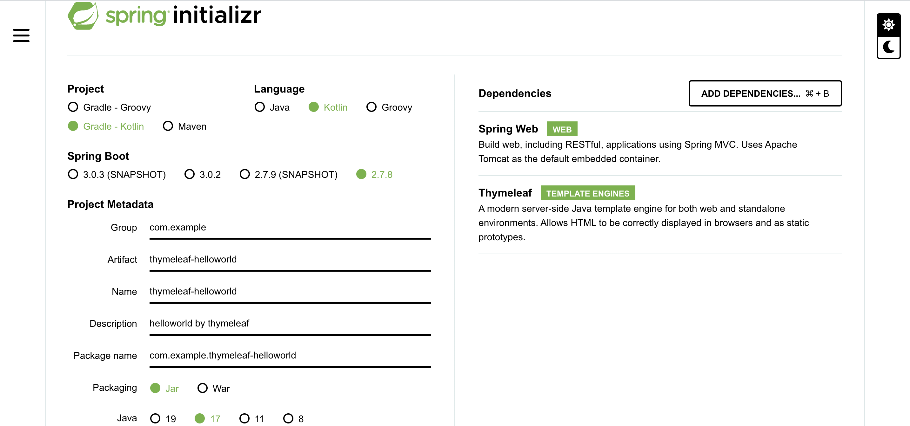

## 概要

- kotlin-server-side-programming-practice:
  - [Kotlin サーバーサイドプログラミング実践開発：書籍案内｜技術評論社](https://gihyo.jp/book/2021/978-4-297-11859-4)

- kotlin-spring-data-jdbc-web-api-demo
  - [Kotlin + SpringWeb + Spring Data JDBC で Web API サーバーを作成する](https://zenn.dev/msksgm/articles/20221028-kotlin-spring-data-jdbc-web-api#kotlin%EF%BC%88sprint-boot%EF%BC%89%2B-spring-data-jdbc-%E3%81%A7-web-api-%E3%82%B5%E3%83%BC%E3%83%90%E3%83%BC%E3%82%92%E4%BD%9C%E6%88%90)の写経

- thymeleaf-helloworld
  

  
Spring Initializr

    

  
